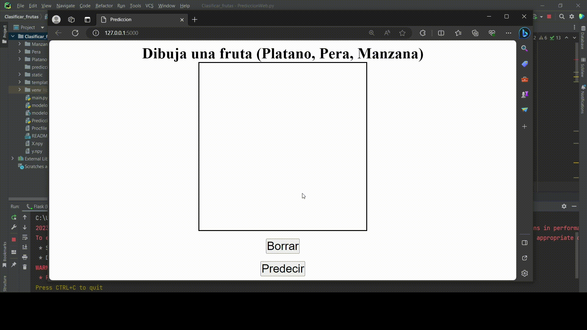

# Clasificacion_frutas

## Curso: Computación Gráfica CC431
## Alumno: Fernandez Aroni Franky Adriel

## ⚠️ Importante! ⚠️
tensorflow = 2.x

## 🔍 ¡Analizando el repositorio!
- El archivo `main.py` tiene como funcionalidad crear el dataset donde se debe hacer lo que se pide.
- EL archivo `model.py` tiene como funcionalidad crear el modelo para las predicciones.
- El archivo `PrediccionWeb.py` tiene como funcionalidad dibujar una fruta para luego mostrar los porcentajes de a que fruta se parece.

## Demostración

